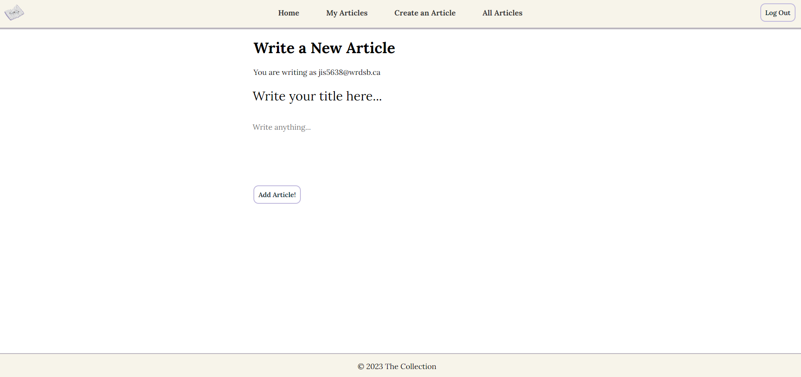
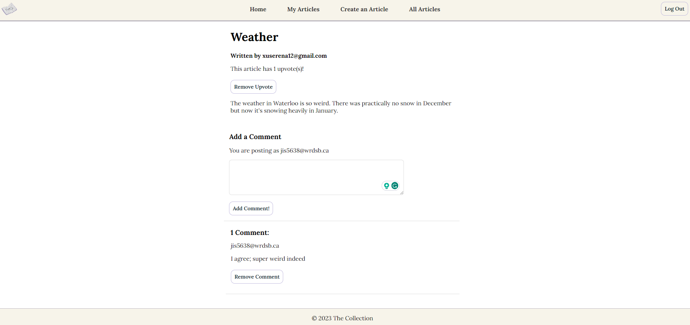

# The Collection 📖

## Overview 📝
The collection is a full-stack web application **where users can share articles**, upvote, comment, and discover new ideas — inspired by Medium and Reddit.

## Technology Stack 🛠️
- **Frontend:** React
- **Backend:** Node.js & Express.js
- **Database:** MongoDB
- **User Authentication:** Firebase

## Features 🖋️
- **User authentication** with email/password (Firebase).
- **Create, edit, delete** articles through a responsive editor.
- **Upvote** and **comment** on articles.
- **Auto-generated topic tags** for easier discovery (TextRazor API).
- **Animated typewriter home page** and **dynamic UI** for a smoother experience.

## Challenges Faced ⚙️
- **MongoDB ObjectId Handling:**  
Treated MongoDB ObjectIds as regular strings during API calls, causing query failures.  
**Solution:** Properly handled ObjectIds using Mongoose methods such as `mongoose.Types.ObjectId` for accurate querying.

- **External API (TextRazor) CORS Errors:**  
Got CORS errors when calling TextRazor directly from the frontend.  
**Solution:** Shifted API calls to the backend server and routed responses back to the frontend to bypass CORS restrictions.

- **Asynchronous Data Fetching Issues:**  
API data sometimes appeared out of sync with frontend rendering, leading to missing or duplicated articles.  
**Solution:** Improved use of `useEffect` hooks with correct dependency arrays and introduced explicit loading states.

## Installation 📋
To run The Collection locally, first, clone this repository using [this HTTP link.](https://github.com/Skylarrji/the-collection.git)

Then, open the cloned repository on VSCode and open two terminals:

### Terminal #1 (Frontend)
Enter the following commands:
- `cd my-webap`
- `npm i` 
- `npm start`

### Terminal #2 (Backend)
Enter the following commands:
- `cd my-webapp-backend` 
- `npm i` 
- `npm run dev`

## Usage 💻
1. [Visit this website.](the-collection-m5s0.onrender.com/)
2. Sign up or log in to start exploring and sharing articles!
3. Feel free to create your own articles or interact with the community by upvoting and commenting.

## Photos 📷
|  |
|:--:| 
| *Home Page* |

|  |
|:--:| 
| *My Articles Page* |

|  |
|:--:| 
| *Article Drafting Page* |

|  |
|:--:| 
| *Article Editing Page* |

|  |
|:--:| 
| *Articles Page* |

|  |
|:--:| 
| *Article Viewing* |

## Project Status 🚧
This project is currently in development, so stay tuned for new features!
