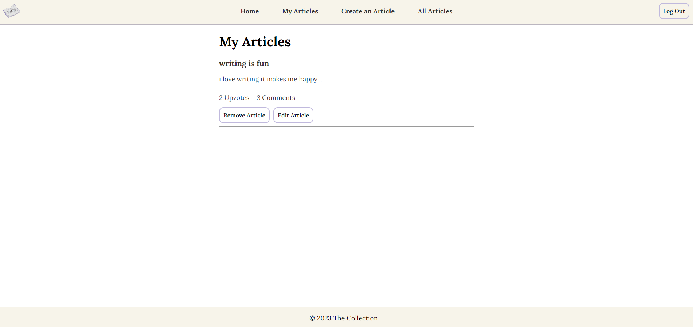

# The Collection 📖

# Purpose 📝
Want to be able to share your ideas freely with others? Then visit The Collection, a web app inspired by popular sites such as Medium and Reddit where users can not only post articles that represent who they are and what they're interested in, but also upvote and comment on other people's articles as well!

# Features 🖋️
- **User Authentication:** Users can create and log into their accounts using an email address.
- **Article Addition, Editing + Removal:** Users can create new articles, edit and delete them using the web app's interactive interface.
- **Upvoting:** Users can upvote and undo their upvote on articles they like (or later dislike).
- **Commenting:** Users can add and delete comments to all articles in the database.
- - **Topic Tags:** For each article, relevant topic tags are automatically generated to allow for easier searching and identification of relevant articles.
- **Interface:** The web app provides a visually appealing and simple layout to allow ease of use, such as the screen resizing dynamically when a new article is being written with invisible text input boxes as well as an animated typewriter home page. 

# Technologies Used 🛠️
- **Frontend:** React
- **Backend:** Node.js & Express.js
- **Database:** MongoDB
- **User Authentication:** Firebase

# Installation 📋
To run The Collection locally, first, clone this repository using [this HTTP link.](https://github.com/Skylarrji/the-collection.git)

Then, open the cloned repository on VSCode and open two terminals:

### Terminal #1 (Frontend)
Enter the following commands:
- `cd my-webap`
- `npm i` 
- `npm start`

### Terminal #2 (Backend)
Enter the following commands:
- `cd my-webapp-backend` 
- `npm i` 
- `npm run dev`

# Usage 💻
1. [Visit this website.](the-collection-m5s0.onrender.com/)
2. Sign up or log in to start exploring and sharing articles!
3. Feel free to create your own articles or interact with the community by upvoting and commenting.

# Photos 📷
|  |
|:--:| 
| *Home Page* |

|  |
|:--:| 
| *My Articles Page* |

|  |
|:--:| 
| *Article Drafting Page* |

|  |
|:--:| 
| *Article Editing Page* |

|  |
|:--:| 
| *Articles Page* |

|  |
|:--:| 
| *Article Viewing* |

# Project Status 🚧
This project is currently in development, so stay tuned for new features!
